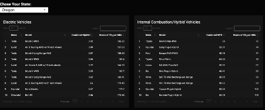

# ⚡️ The Electric Vehicle Buyers Guide

This dashboard visualizes state-level carbon emissions for electric vehicles (EVs) and compares them with high-efficiency internal combustion engine (ICE) and hybrid vehicles. Built using R and Shiny, the project enables consumers and policymakers to explore how regional electricity generation impacts the real-world environmental benefits of EV ownership.

---

## 🧠 Project Summary

This project was developed as part of my undergraduate thesis at Indiana University Indianapolis. The goal was to create a transparent and interactive tool for evaluating the carbon footprint of EVs on a per-mile basis, using publicly available emissions and vehicle data from 2022.

> **Thesis Title**: *The Electric Vehicle Buyers Guide*  
> **Core Question**: Do electric vehicles consistently offer lower carbon emissions per mile than internal combustion engine vehicles when electricity generation emissions are accounted for?

---

## 🔍 Key Findings

- In **all 50 states**, EVs emitted more CO₂ per mile than the most efficient ICE/hybrid vehicles when electricity generation was factored in.
- Even in clean-energy states like Oregon, top-performing EVs (e.g., Tesla Model 3 RWD) had higher CO₂ emissions per mile than ICE vehicles such as the Toyota RAV4 Prime.
- The study highlights that **regional electricity emissions are the dominant factor** in determining whether EVs are environmentally beneficial.

---

## 🛠 Technologies Used

- **Frontend**: R Shiny, shinydashboard, plotly
- **Data Cleaning**: R (dplyr, tidyr)
- **Mapping**: urbnmapr, urbnthemes
- **Data Sources**:
  - U.S. EPA Power Plant CO₂ Emissions (2022)
  - U.S. EIA State Electricity Generation Data
  - U.S. EPA Vehicle Dataset (Model Year 2022)

---

## 📈 Dashboard Features

- **State-by-State Analysis**: Compare emissions between EVs and ICE vehicles based on your selected state
- **Efficiency Score**: A custom metric that ranks each state’s clean energy performance
- **Choropleth Map**: Visualizes grams of CO₂ emitted from electricity generation by state
- **Vehicle Comparison Tool**: Explore emissions per mile for top EVs and hybrids by region

---

## 🚀 Live App

View the live dashboard here:  
👉 [https://jakedcook.shinyapps.io/code/](https://jakedcook.shinyapps.io/code/)

---

## 📊 Screenshots

**📷 
**📷  
**📷 

---

## 🧩 Methodology Summary

- Converted vehicle efficiency (MPGe and MPG) into grams of CO₂ per mile
- Calculated EV emissions using:  
  `EV gCO₂/mile = (gCO₂/kWh by state) × (kWh per mile by vehicle)`
- Merged multiple public datasets (emissions, generation, vehicle specs) in R
- Originally designed with Python, Flask, and PostgreSQL — later migrated to R + Shiny for deployment via shinyapps.io

---

## 📌 Limitations

- Does **not** include lifecycle emissions (battery production, vehicle manufacturing)
- Assumes average vehicle efficiency and charging patterns
- Uses 2022 data only (static snapshot — no forecast modeling)

---

## 🔮 Future Enhancements

- Incorporate **time-of-day charging** and **marginal emissions factors**
- Add support for **projected grid decarbonization**
- Include lifecycle emissions (battery manufacturing, recycling)
- Enable vehicle lookup by VIN or user input

